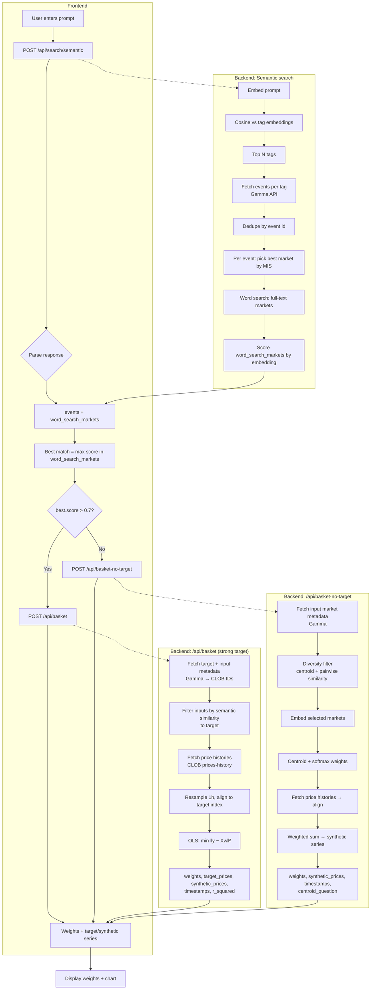

# Data pipeline: Prompt → Basket weights

End-to-end flow from the user’s search prompt to the returned basket weights (and optional time series).

## Stages in words

| Stage | Where | What |
|--------|--------|--------|
| **1. Prompt** | Frontend | User types a query (e.g. “Fed rate decision March”). |
| **2. Semantic search** | `POST /api/search/semantic` | Embed prompt → match to cached Polymarket tags → fetch events per tag (Gamma) → dedupe → for each event pick one “best” market (MIS) → also run word search and score those markets by embedding. Return `events` (with `best_market`) and `word_search_markets` (with `score`). |
| **3. Decide path** | Frontend | Take best-scoring word-search market. If `best.score > 0.7` → call **basket (with target)**; else → call **basket-no-target**. Build `input_market_ids` from `events[].best_market.id` (unique, up to 15). |
| **4a. Basket with target** | `POST /api/basket` | One target market + list of input markets. Fetch metadata (Gamma) and CLOB IDs → filter inputs by semantic similarity to target → fetch 7d price history (CLOB) → resample to 1h and align to target → OLS to get weights. Return `weights`, `target_prices`, `synthetic_prices`, `timestamps`, `r_squared`. |
| **4b. Basket no-target** | `POST /api/basket-no-target` | Only input markets. Fetch metadata → diversity filter (centroid + max pairwise similarity) → embed selected markets → softmax( similarity to centroid ) → optional lognormal noise and renormalize → fetch price histories → align → weighted sum for synthetic series. Return `weights`, `synthetic_prices`, `timestamps`, `centroid_question`. |
| **5. Show result** | Frontend | Render basket weights (and optional time-series chart). |

## Data sources

- **Tag cache**: Polymarket events → unique tags → embedded tag labels (refreshed periodically).
- **Gamma API**: Events by tag, event by slug; market metadata (question, description, `clobTokenIds`).
- **CLOB API**: `prices-history` (market token ID + `startTs`/`endTs` or `interval`).
- **Embedding model**: e.g. BAAI/bge or similar for prompt, questions, and tag labels.

## Key outputs

- **Weights**: List of `{ title, market_id, weight[, similarity] }` summing to 1 (or near 1 after noise).
- **With target**: `target_prices`, `synthetic_prices`, `timestamps`, `r_squared`, `target_question`.
- **No target**: `synthetic_prices`, `timestamps`, `centroid_question`, `temperature`.
